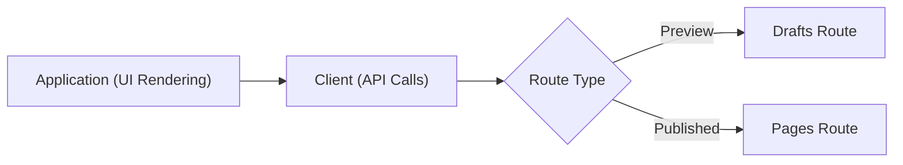
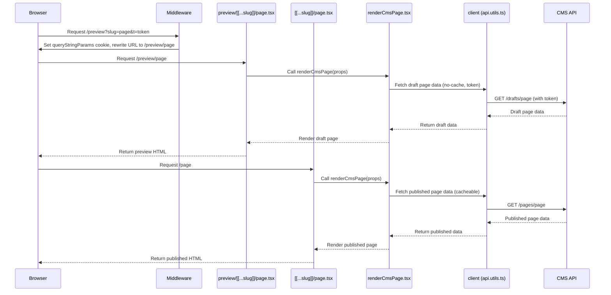

# CDD-1379 - Page Previews

**Date:** 2026-02-27

**Ticket:** https://ukhsa.atlassian.net/browse/CDD-1379?search_id=055fe61d-bee9-48d9-80bc-ffb0f1c26b76&referrer=quick-find

**Authors:** Jean-Pierre Fouche

**Impact:** Affects all pages - broad testing required

**Testing:** Comprehensive unit tests supplied. UAT needed.

## Summary

Allow the front-end application to render uncached draft versions of a CMS page by requesting the **/previews** path with slug and a secure token - this constitutes a presigned URL.

## Design Approach

- Page previews and Published views must be rendered with the same logic.
- Minimal touch to existing code - an "orthogonal" approach to drafts rendering (drafts are treated as a routing concern, independent of the UI), whereby the existing code is largely untouched. API calls to CMS are **rerouted** centrally through the `client` function.
- No caching for page previews:
  - No Incremental Static Regeneration (ISR) for /previews route rendering - this is set unconditionally
  - No client caching on any API calls to fetch drafts from CMS
- Pages will be fetched securely through presigned URLs, authenticated with a token having a narrow expiry.
- Access to presigned URLs will be provided through the CMS, which requires user login.
- Feature flag to enable/disable page previews. This will enable previews to be deployed in a private instance of the application, should the UKHSA decide upon this in the future. The application will be deployed to the public internet.



## Stack Flow

When a user requests a preview URL, the following flow occurs:

- **Middleware** intercepts `/preview?...` requests, validates params, sets a cookie named `queryStringParams` (with `isPreview` and `t`), and rewrites the URL to `/preview/[slug]`.
- **Next.js routing** matches the new `/preview/[slug]` route, handled by `src/app/(cms)/preview/[[...slug]]/page.tsx`.
- This preview route sets `force-dynamic` to disable caching for all preview content.
- **API Calls** to CMS are serviced through the **client** function in [./app/(cms)/api.utils.ts](<./app/(cms)/api.utils.ts>). All API calls beginning with "pages" are redirected to "drafts".
- **Common rendering logic** is used for both draft and published content; only cache settings differ.

```
User Request: /preview?slug=whats-new&t=abc123
	 |
	 v
 [middleware.ts] -- set cookie, rewrite URL --> /preview/whats-new
	 |
	 v
 [preview/[[...slug]]/page.tsx] -- force-dynamic (no cache)
	 |
	 v
 [`client` in api.utils.cs] -- `no-cache`, uses token in header, "pages" rewritten to "drafts"
	 |
	 v
 [renderCmsPage.tsx] -- common rendering for draft/published routes
```

## Component Flow

### Page Preview Routing and Rendering

The following diagram illustrates the flow of a page preview request through the application stack. It shows how a browser request for a preview or published page is processed by the middleware, routed to the correct Next.js page, and ultimately rendered using shared logic. The process ensures that preview (draft) content is always uncached and securely fetched from the CMS using a presigned token, while published content follows the standard cacheable path.

**Key components:**

- **Browser (URL):** Initiates the request for a preview or published page.
- **Middleware:** Intercepts preview requests, sets cookies, and rewrites URLs.
- **Next.js Page Route (preview/[[...slug]]/page.tsx or [[...slug]]/page.tsx):** Handles the route, disables caching for previews.
- **Common Rendering Logic (renderCmsPage.tsx):** Renders both preview and published content.
- **Client (api.utils.ts):** Handles API calls to the CMS, with special handling for preview/draft requests, transforming all routes beginning with "pages" to begin with "drafts".
- **CMS API:** Provides draft or published page data.

---

Note for VSCode users: The diagram below requires the `Markdown Preview Mermaid Support` extension.



## Files Changed

| File Name                                     | Purpose of Change                                                                                | Process                                                                                                                                                                                            |
| --------------------------------------------- | ------------------------------------------------------------------------------------------------ | -------------------------------------------------------------------------------------------------------------------------------------------------------------------------------------------------- |
| src/middleware.ts                             | Middleware for preview cookies/logic                                                             | **Input:** HTTP requests<br>**Process:** Sets/reads cookies for preview mode, handles session and preview logic<br>**Output:** Requests routed with correct preview context.                       |
| src/app/(cms)/layout.tsx                      | CMS layout adjustments                                                                           | **Input:** Layout props, children<br>**Process:** Provides layout for CMS and preview pages<br>**Output:** Consistent UI for all CMS routes.                                                       |
| src/app/(cms)/metadata.ts                     | Metadata generation for CMS/preview                                                              | **Input:** Route params, search params<br>**Process:** Calls `getPageMetadata` for SEO/meta tags<br>**Output:** Dynamic metadata for both published and preview pages.                             |
| src/app/(cms)/[[...slug]]/page.tsx            | Main CMS page route                                                                              | **Input:** Route params, search params<br>**Process:** Calls `renderCmsPage` for published CMS pages<br>**Output:** Renders correct CMS page.<br>_Example:_ `/cms/landing`                         |
| src/app/(cms)/preview/[[...slug]]/page.tsx    | Preview route for CMS pages                                                                      | **Input:** Route params, search params<br>**Process:** Calls `renderCmsPage` for preview (uncached)<br>**Output:** Renders preview version of CMS page.<br>_Example:_ `/cms/preview/landing`       |
| src/app/utils/cms/renderCmsPage.tsx           | Shared CMS page rendering logic (no change to existing logic, just refactor to shared component) | **Input:** Route params, search params<br>**Process:** Determines page type, renders correct component, handles preview/published logic<br>**Output:** React component for requested CMS page.     |
| src/app/utils/cms/index.ts                    | CMS utility changes                                                                              | **Input:** Slug, page type, search params<br>**Process:** Validates slugs, fetches page data, generates metadata<br>**Output:** Correct data for rendering CMS and preview pages.                  |
| src/api/requests/getSearchParamsFromCookie.ts | Utility to extract search params from cookies                                                    | **Input:** HTTP request cookies (with `queryStringParams`)<br>**Process:** Parse JSON from cookie, return as key-value map<br>**Output:** `{ t: "abc123", isPreview: "true" }`                     |
| src/api/utils/api.utils.ts                    | API utility changes for preview support                                                          | **Input:** API request options, environment flags<br>**Process:** Adjusts caching, headers, and request handling for preview mode<br>**Output:** API requests behave correctly in preview context. |
| src/api/utils/api.utils.spec.ts               | Tests for API utilities                                                                          | **Input:** Mocked API requests and cookies<br>**Process:** Test preview-related logic and header handling<br>**Output:** Verified correct API utility behavior in preview scenarios.               |
| src/config/constants.ts                       | Feature flag and config for previews                                                             | **Input:** Environment variables<br>**Process:** Exposes `pagePreviewsEnabled` and related flags<br>**Output:** Feature toggling for preview functionality.                                        |
| src/app/hooks/useTimeseriesFilter.tsx         | Sonar violation fixes (unrelated)                                                                | **Input:** Linting/SonarQube feedback<br>**Process:** Code changes to address Sonar violations<br>**Output:** No functional change; not related to the current ticket.                             |

## Sonar

To address Sonar issues, extensive refactoring has been applied to `middleware.ts` and `api.utils.cs`. The `client` function in api.utils.cs and the `middleware` function in `middleware.ts` have been broken up into smaller functions, thus addressing the issue of high complexity within these functions.

## Configuration

Set the environment variable PAGE_PREVIEWS_ENABLED=['true' | 'false'] to set this server up for serving page previews. This will enabling set up of a private instance of the server with page previews enabled, while keeping the public instance with page previews disabled. The default value for this setting is false.
