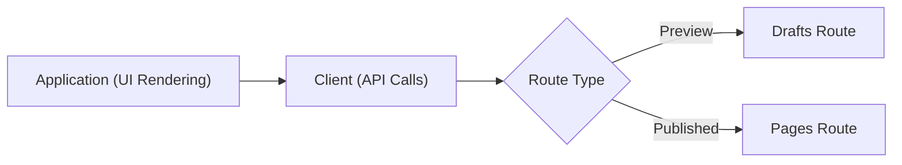
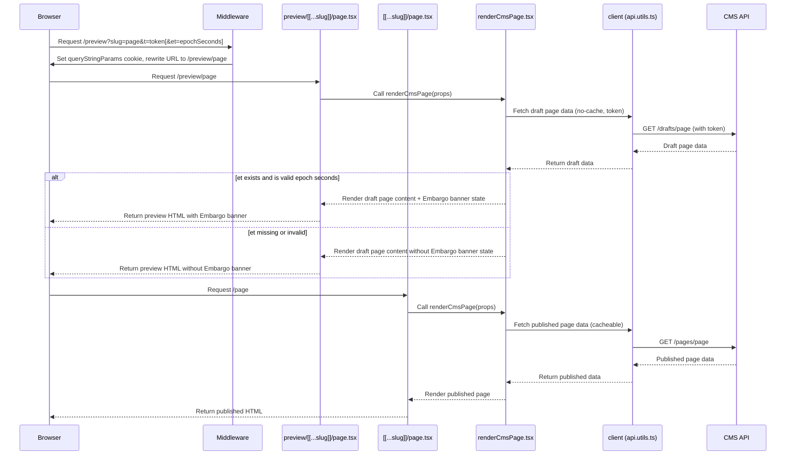
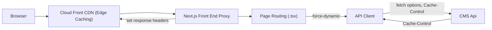

# CDD-1379 - Page Previews

**Date:** 2026-02-27

**Ticket:** https://ukhsa.atlassian.net/browse/CDD-1379?search_id=055fe61d-bee9-48d9-80bc-ffb0f1c26b76&referrer=quick-find

**Authors:** Jean-Pierre Fouche

**Impact:** Affects all pages - broad testing required

**Testing:** Comprehensive unit tests supplied. UAT needed.

## Summary

Allow the front-end application to render uncached draft versions of a CMS page by requesting the **/previews** path with slug and a secure token - this constitutes a presigned URL. The implementation also supports embargo time travel, where an optional `et` querystring parameter controls whether an Embargo banner is displayed.

## Design Approach

- Page previews and Published views must be rendered with the same logic.
- Minimal touch to existing code - an "orthogonal" approach to drafts rendering (drafts are treated as a routing concern, independent of the UI), whereby the existing code is largely untouched. API calls to CMS are **rerouted** centrally through the `client` function.
- No caching for page previews:
  - No Incremental Static Regeneration (ISR) for /previews route rendering - this is set unconditionally
  - No client caching on any API calls to fetch drafts from CMS
- Pages will be fetched securely through presigned URLs, authenticated with a token having a narrow expiry.
- Access to presigned URLs will be provided through the CMS, which requires user login.
- Feature flag to enable/disable page previews. This will enable previews to be deployed in a private instance of the application, should the UKHSA decide upon this in the future. The application will be deployed to the public internet.



## Stack Flow

When a user requests a preview URL, the following flow occurs:

- **Middleware** intercepts `/preview?...` requests, validates params, sets a cookie named `queryStringParams` (with `isPreview` and `t`), and rewrites the URL to `/preview/[slug]`.
- **Next.js routing** matches the new `/preview/[slug]` route, handled by `src/app/(cms)/preview/[[...slug]]/page.tsx`.
- This preview route sets `force-dynamic` to disable caching for all preview content.
- **API Calls** to CMS are serviced through the **client** function in [./app/(cms)/api.utils.ts](<./app/(cms)/api.utils.ts>). All API calls beginning with "pages" are redirected to "drafts".
- **Common rendering logic** is used for both draft and published content; only cache settings differ.

```
User Request: /preview?slug=whats-new&t=abc123
	 |
	 v
 [middleware.ts] -- set cookie, rewrite URL --> /preview/whats-new
	 |
	 v
 [preview/[[...slug]]/page.tsx] -- force-dynamic (no cache)
	 |
	 v
 [`client` in api.utils.cs] -- `no-cache`, uses token in header, "pages" rewritten to "drafts"
	 |
	 v
 [renderCmsPage.tsx] -- common rendering for draft/published routes
```

## Embargo Time Travel

The application supports an optional embargo time travel querystring parameter named `et`.

- If `et` is present and is a valid epoch-seconds value, the app enables embargo time travel context for the request and displays the Embargo banner in the UI.
- If `et` is missing or invalid, embargo time travel is ignored and no Embargo banner is rendered.

This behavior is additive and does not alter the draft/published routing logic.

## Component Flow

### Page Preview Routing and Rendering

The following diagram illustrates the flow of a page preview request through the application stack. It shows how a browser request for a preview or published page is processed by the middleware, routed to the correct Next.js page, and ultimately rendered using shared logic. The process ensures that preview (draft) content is always uncached and securely fetched from the CMS using a presigned token, while published content follows the standard cacheable path.

**Key components:**

- **Browser (URL):** Initiates the request for a preview or published page.
- **Middleware:** Intercepts preview requests, sets cookies, and rewrites URLs.
- **Next.js Page Route (preview/[[...slug]]/page.tsx or [[...slug]]/page.tsx):** Handles the route, disables caching for previews.
- **Common Rendering Logic (renderCmsPage.tsx):** Renders both preview and published content.
- **Client (api.utils.ts):** Handles API calls to the CMS, with special handling for preview/draft requests, transforming all routes beginning with "pages" to begin with "drafts".
- **CMS API:** Provides draft or published page data.

---

Note for VSCode users: The diagram below requires the `Markdown Preview Mermaid Support` extension.



## Caching

Caching is disabled for page previews.
This covers the following routes: `/preview*'` for draft pages and `'/nocache*'` for published pages. The CMS Page Preview functionality covers both routes (by means of the "Preview" and "View Live" buttons)

Caching has been effected at the following layers:

- Routing layer (i.e. (i.e. .tsx files), by means of the directive `export const dynamic = 'force-dynamic'` in:
  - ./src/app/(cms)/nocache/[[...slug]]/page.tsx for **draft** pages
  - ./src/app/(cms)/nocache/[[...slug]]/page.tsx for **published** pages

- Fetch layer (i.e. client in api.utils.cs)
  - fetchOptions set to 'no-store', thus disabling next.js server data caching for fetch requests
  - request headers ('Cache-Control') set : `"Cache-Control": "no-store, no-cache, must-revalidate"`. This requests that the CMS API server serves uincached content. Note that this is requested; the CMS API is responsible for honouring the request.

- Proxy/Middleware Layer (i.e. proxy.ts)
  - Response headers are set. This is a request to the downstream CDN layer (CloudFront) not to cache the response. Again, it is up to CloudFront to respond accordingly: `response.headers.set('Cache-Control', 'no-store, no-cache, must-revalidate')`



In the above diagram:

- The User (Browser) makes a request via DNS to the CloudFront edge. _ Depending upon the route (`/preview/_`, `/nocache/\*`), CloudFront behaviours will effect a policy to disable caching.
- CloudFront forwards the request to the Application Load Balancer (for conciseness, this is not in the diagram), which then forwards the request to Next.js.
- Next.js proxy (middleware) sets response headers for CloudFront, routes the request through a component tree, which has "force-dynamic" set at the root. "Force-dynamic" ensures that page rendering is not cached.
- During rendering, Next.js goes through the client (`api.utils.ts`) and the client builds a request (to the CMS api) with appropriate Cache-Control headers.
- The CMS API (not part of this repository) is expected to honour the Cache-Control headers by returning an uncached response.

## Sonar

To address Sonar issues, extensive refactoring has been applied to `middleware.ts` and `api.utils.cs`. The `client` function in api.utils.cs and the `middleware` function in `middleware.ts` have been broken up into smaller functions, thus addressing the issue of high complexity within these functions.

## Configuration

Set the environment variable PAGE_PREVIEWS_ENABLED=['true' | 'false'] to set this server up for serving page previews. This will enabling set up of a private instance of the server with page previews enabled, while keeping the public instance with page previews disabled. The default value for this setting is false.

## Testing

Page previews can be tested using the following commands:

We must test "Preview", "View Live", and "Live" scenarios:

- "Preview" entails testing a **draft** version of the page.
- "View Live" entails testing the **published** page from the CMS UI.
- "Live" entails testing the rendering of the page directly in the front end, without page previews (this is a regression test).

### "Preview" Test

**Draft version shows preview button and date picker**

- Open the CMS backend on the "Cookies" page in **edit** mode.
- Make some edits to the page - e.g. append a few words to one of the fields.
- Save a draft version of the page.
- **Expected result:**
  - the "Preview" button appears, along with a date picker for Embargo Date.
  - The page content reflects the edits made in edit mode.

**Draft version with embargo date renders with embargo banner**

- Choose an embargo date and then click "Preview"
- **Expected Result:**
  - After a longer delay than usual (since caching should be disabled) the Cookies page appears, displaying an Embargo date banner, appropriately formatted.

**Draft version with embargo date 'now' renders without a banner**

- Open the "Cookies" page, saved as a draft.
- Open the Embargo Date picker and select "Now"
- Click "Preview"
- **Expected result**: The page renders (after a slight delay as caching should be disabled) without am Embargo banner.

**Preview request returns cache miss**

This is a low-level test that is executed on the command line, to reveal cache headers.

Choose either of the following options (or try each of them in succession, should you wish):

- **Draft version with embargo date renders with embargo banner**
- **Draft version with embargo date 'now' renders without a banner**

- Copy the URL from the browser - this will be used as input to the command below.
- Run the following command:

```bash
# Using /preview route to disable caching
# Also, the base64 token payload is carried in the querystring
>curl -sI 'https://c05386dc.dev.ukhsa-dashboard.data.gov.uk/preview/cookies?t=eyJwYWdlX2lkIjozOSwiaWF0IjoxNzc3NDU1MjU3LCJleHAiOjE3Nzc0NTUyODcsImVtYmFyZ29fdGltZSI6MjIyNDYyMzYwMH0%3A1wI1JB%3AlaXw0bzft3z6lOmPC0PsD6VsyfjLhgLxFVEvYYZGa6Y&page_id=39&et=2224623600' | grep -iE 'Cache-Control|x-cache'
cache-control: no-store, no-cache, must-revalidate
x-cache: Miss from cloudfront
```

**Expected Result:** appropriate headers are returned, as above. `cache-control: no-store, no-cache, must-revalidate` and `x-cache: miss` indicate that the cache has not been hit.

**Preview request supplies correct querystring parameters and token**

- Generate a preview request as below:

- **Draft version with embargo date renders with embargo banner**

- Inspect the querystring to validate its contents.

**Expected Result:** Querystring contains:

- `et` parameter with an integer representing the embargo time
- `t` parameter containing the HMAC token
- `page_id` parameter containing the page_id

- Copy the token and run the command below to inspect the time value. The command decodes the token from base64 and then extracts the expiry date as an integer in Unix epoch seconds, rendering it finally as a human-readable date:

```bash
>echo eyJwYWdlX2lkIjozOSwiaWF0IjoxNzc3NDU1MjU3LCJleHAiOjE3Nzc0NTUyODcsImVtYmFyZ29fdGltZSI6MjIyNDYyMzYwMH0%3A1wI1JB%3AlaXw0bzft3z6lOmPC0PsD6VsyfjLhgLxFVEvYYZGa6Y | base64 -d 2>/dev/null | jq -r '.exp' | xargs -I {} sh -c "date -d @{}"

Wed 29 Apr 10:34:47 BST 2026 # Must be PAGE_PREVIEW_TOKEN_TTL ahead, currently 30s
```

**Expected Result:** The time displayed in the command output should be ahead of `time now` by the value configured for PAGE_PREVIEW_TOKEN_TTL, currently configured to be 30s. The PAGE_PREVIEW_TOKEN_TTL can be discovered through the ECS task definition.

### View Live Test

**View Live button renders a page after publishing**

- Open the Cookie page in edit mode
- Make some edits
- Click **Publish**

**Expected Result** The post-publish message box appears with two buttons, "View Live" and "Edit".

- Click "View Live"

**Expected Result:** The page renders correctly, showing the edits made.

**View live URL renders the correct caching headers**

This test uses the commandline to inspect the headers returned from a "View Live" request.

- Follow the steps in **View Live button renders a page after publishing** and copy the url from the browser into the command below:

```bash
# Using /nocache route to render published page with no cache
>curl -sI 'https://c05386dc.dev.ukhsa-dashboard.data.gov.uk/nocache/cookies' | grep -iE 'Cache-Control|x-cache'
cache-control: no-store, no-cache, must-revalidate
x-cache: Miss from cloudfront
```

**Expected Result:**

- `cache-control` and `x-cache` headers render as above, indicating that caching has been disabled. This is therefore a freshly computed render of the page.

**View Live button on the edit page renders the correct output**

- Open the Cookies page in edit mode.
- Click `Publish` to ensure that the page has been published.
- In the resulting message box, click `Edit` to return to the edit page
- Click "View Live" and repeat the assessments that are described above for the "post publish" "View Live" button that appears in the message box. We are now testing the same, but for the "View Live" button on the edit page.

### Live Regression Test (Current Functionality)

**Live page renders correctly**

- Navigate to the Cookies page, using the following URL: [https://c05386dc.dev.ukhsa-dashboard.data.gov.uk/cookies](https://c05386dc.dev.ukhsa-dashboard.data.gov.uk/cookies)

**Expected Result:** The page renders correctly

**Live page returns correct cache headers**

- Use the command below to inspect the cache headers for the "Cookies" live page:

```bash
# using straight URL - no '/nocache' or '/preview' route
curl -sI 'https://c05386dc.dev.ukhsa-dashboard.data.gov.uk/cookies' | grep -iE 'Cache-Control|x-cache'
cache-control: private, no-cache, no-store, max-age=0, must-revalidate
x-cache: Hit from cloudfront
```

**Expected Result:**

The above cache headers are returned. Note that `x-cache` indicates that the cache is being hit. The `cache-control` headers correctly indicate that caching is in place.

### Notes about testing

**Caching:**

Edits are visible immediately on the Front End because caching has been disabled through Preview routes. This would otherwise be impossible.

**Embargo Date**

- The embargo date must be tested against all of the page types which render embargo data.
- The page must render data currently under embargo when the embargo date has been moved forward.
