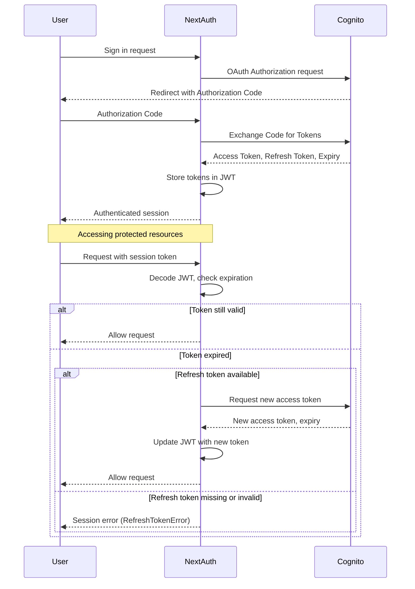

# Authentication Middleware & Token Refresh

## Overview

Our authentication system uses Next.js middleware to protect routes and manage authentication state. The middleware handles both route protection and token refresh, ensuring users maintain valid authentication while using the application.

## Middleware Flow

1. **Route Protection**

   - Checks if authentication is enabled (`AUTH_ENABLED === 'true'`)
   - Excludes NextAuth API routes and health check endpoints
   - Redirects unauthenticated users to `/start` for protected routes

2. **Token Validation & Refresh**
   - Validates the current session token
   - Checks if the token needs refreshing (within 30 seconds of expiry)
   - Automatically refreshes tokens when needed

## Token Refresh Mechanism

### When Does Refresh Happen?

Tokens are refreshed when:

- The current token is within 30 seconds of expiry (`TOKEN_REFRESH_BUFFER_SECONDS`)
- The user is actively using the application
- The refresh token is still valid

### Refresh Process

1. **Token Check**

   ```typescript
   function shouldUpdateToken(token: JWT) {
     const timeInSeconds = Math.floor(Date.now() / 1000)
     const isExpiring = token?.expires_at && timeInSeconds >= token.expires_at - TOKEN_REFRESH_BUFFER_SECONDS
     return isExpiring
   }
   ```

2. **Token Refresh Request**

   - Makes a POST request to Cognito's token endpoint
   - Uses the refresh token to obtain new access and refresh tokens
   - Updates the session with new token information

3. **Session Update**
   - Encodes the new token information
   - Updates the session cookie
   - Handles large tokens by splitting into chunks if needed

## Implementation Details

### Middleware Configuration

```typescript
export const config = {
  matcher: [
    // Skip Next.js internals and all static files, unless found in search params
    '/((?!_next|[^?]*\\.(?:html?|css|js(?!on)|jpe?g|webp|png|gif|svg|ttf|woff2?|ico|csv|docx?|xlsx?|zip|webmanifest)).*)',
    // Always run for API routes
    '/(api|trpc)(.*)',
  ],
}
```

### Token Refresh Prevention

To prevent multiple simultaneous refresh attempts:

```typescript
let isRefreshing = false

export async function refreshAccessToken(token: JWT): Promise<JWT> {
  if (isRefreshing) {
    return token
  }
  isRefreshing = true
  try {
    // ... refresh logic ...
  } finally {
    isRefreshing = false
  }
}
```

## Token Refresh Flow

[View this diagram in Mermaid Live Editor](https://mermaid.live/edit#pako:eNqNVE1v4jAQ_SuWT7tSQElIoORQaUW5rLRdqbSqtOLiTYZgkdis4_BRxH_fsZ1QCqRqDigZvzfz5o2ZA01lBjShFfyrQaTwwFmuWDkXBJ81U5qnfM2EJi8VqOvoI-z0j1ovr08mMhdcS3dgyL37-xadkBnPBeGCKFO20g7VHiOyYSfktwkQ8yMVf2OaywtSg-whyVRJyBNkXEGqyZZfMSfYbIeiLuAtUdNdumQiBwsjC6nIs1yBqK4UnaVPU6gqh_NQ40JBtWw_p7s1V_uremd2aamAaFvE2Pbz9fkCfWrffIHAMTANGamwKPbTgKUGIjegbPfepTgucrJWiEkNE_XJWmG8w68nNwTnclPGKfykjwcw183I90i6hHRFwLRuPXc0VmjnCqk0LwqyYQXP3FFHv0Uhtx-vBBQVNElsejhLYPK37lu1hG0YL9jfAt5BXXNvexawJcwN9Kzj9rk5_8cLiuek7TuLvlNf1hnO0pjmzDbVb5T9kjUnez56UHI3frzJXFxYfjv3rJk4KIWkb006a_rUhL6f1RNNNnyhHi1BlYxnuHMOJjyneF9LmNMEXzOmVnM6F0fEsVrL2V6kNNGqBo8qWedLmiwYyvdobU1pttUpipvnj5RlS8FNgH-cX27D2UVnITQ50B1Noqh_N44G4Wg8iKJo4MexR_c06UV-2I_iyA-COAj9YRgcPfpmswb90PfD8Si8C0aDOB4ORh7NlemlkYgdgprIWmiaDOPjf4wdwz4)



## Security Considerations

1. **Token Storage**

   - Tokens are stored in HTTP-only cookies
   - Secure flag is enabled for HTTPS environments
   - SameSite=Lax policy is enforced

2. **Error Handling**

   - Failed refreshes are logged
   - Old tokens are retained as fallback
   - Users are redirected to login on authentication failures

3. **Token Expiry**
   - Access tokens have a limited lifetime
   - Refresh tokens are used to obtain new access tokens
   - Buffer time ensures tokens are refreshed before expiry

## Testing Implications

When writing tests:

1. Consider token expiry timing
2. Account for automatic token refresh
3. Handle cases where refresh fails
4. Test middleware redirects for unauthenticated users
