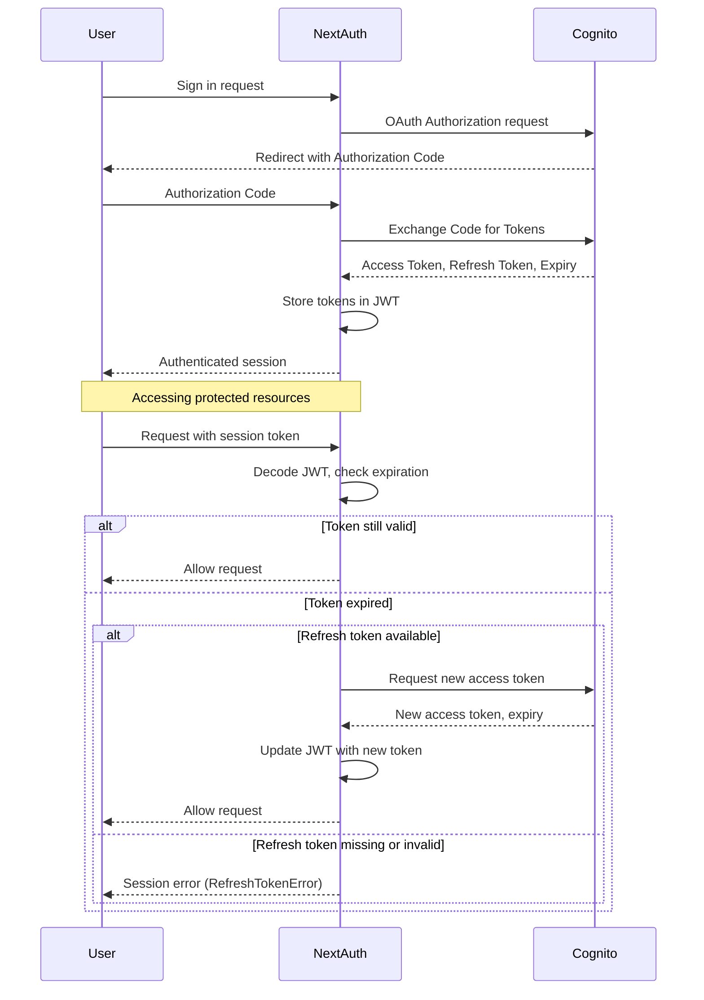

https://authjs.dev/guides/refresh-token-rotation?framework=next-js

```mermaid
sequenceDiagram
    participant User
    participant NextAuth
    participant Cognito

    User->>NextAuth: Sign in request
    NextAuth->>Cognito: OAuth Authorization request
    Cognito-->>User: Redirect with Authorization Code
    User->>NextAuth: Authorization Code

    NextAuth->>Cognito: Exchange Code for Tokens
    Cognito-->>NextAuth: Access Token, Refresh Token, Expiry

    NextAuth->>NextAuth: Store tokens in JWT
    NextAuth-->>User: Authenticated session

    Note over User,NextAuth: Accessing protected resources

    User->>NextAuth: Request with session token
    NextAuth->>NextAuth: Decode JWT, check expiration

    alt Token still valid
        NextAuth-->>User: Allow request
    else Token expired
        alt Refresh token available
            NextAuth->>Cognito: Request new access token
            Cognito-->>NextAuth: New access token, expiry
            NextAuth->>NextAuth: Update JWT with new token
            NextAuth-->>User: Allow request
        else Refresh token missing or invalid
            NextAuth-->>User: Session error (RefreshTokenError)
        end
    end
```
